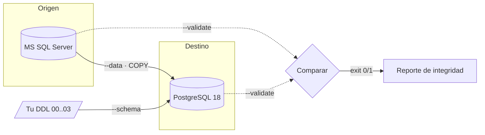

# mssql2pg — Migración y validación de datos MS SQL Server → PostgreSQL

[](LICENSE)
[](https://www.python.org/)
[](migration/requirements.txt)

Toolkit **100% Python** para **migrar los datos** de una base **MS SQL Server** a
**PostgreSQL 18** y **validar la integridad** de la migración **tabla a tabla**.

Es **agnóstico a la base**: sirve para *cualquier* migración MSSQL → PostgreSQL. No
hardcodea tablas — es *schema-driven*, descubre el plan introspeccionando el esquema
destino. Todo va por `psycopg` (v3) + `pyodbc`: **no depende de `psql`, `sqlcmd` ni
`pgloader`**.

> Pensado como paso previo a pruebas manuales en un sandbox pre-producción.
> **No apunta a producción.**

---

## ¿Por qué este toolkit?

- **Cero dependencias de CLIs externas.** Solo Python + dos librerías. Nada de
  `psql`, `sqlcmd`, `bcp`, `pgloader` ni CSVs intermedios.
- **Agnóstico a la base.** Tú traes tu DDL; el toolkit hace el resto para *cualquier*
  esquema MSSQL → PostgreSQL.
- **Integridad verificable.** No solo copia: **valida** conteos, sumas numéricas
  exactas, rango de PK y **paridad de strings byte a byte** (detecta *mojibake* y
  truncamiento). Sale con exit code `0` (íntegra) o `1` (falla) — usable en CI.
- **PK preservados 1:1** y **secuencias re-sincronizadas**, para que la app siga
  insertando sin colisiones.
- **Escaping seguro** vía el protocolo **COPY** de psycopg: texto libre y blobs JSON
  viajan intactos.
- **Cronómetro por etapa y por tabla**, con un "RESUMEN DE TIEMPOS" al final.

## Cómo funciona



Tres etapas, orquestadas por una sola CLI (`migrate.py`):

1. **`--schema`** — crea la base PostgreSQL (locale ICU) y aplica **tu DDL**
   (`00..03.sql`) vía psycopg.
2. **`--data`** — copia los datos MSSQL→PG **preservando los PK**, con las **FK
   deshabilitadas** durante la carga, usando el protocolo **COPY**; al final
   **re-sincroniza las secuencias** identity.
3. **`--validate`** — genera un reporte de integridad de origen y destino y los
   compara: conteos por tabla, sumas de columnas numéricas exactas, rango de PK, y
   **paridad de strings** fila a fila. Exit code `0`=íntegra, `1`=falla.

`--all` corre las tres en orden (implica `--fresh`: DROP+CREATE de la base).

## Requisitos

| Requisito | Para qué |
|---|---|
| **Python 3.8+** | ejecutar todo |
| **psycopg (v3)** | conexión/COPY a PostgreSQL (`pip install -r requirements.txt`) |
| **pyodbc** | leer el MSSQL origen (`pip install -r requirements.txt`) |
| **ODBC Driver 18 (o 17) for SQL Server** | driver que usa pyodbc |
| **PostgreSQL 18 con ICU** | destino (superusuario para deshabilitar FK en la carga) |

Driver ODBC de SQL Server:
- **Windows** — instala el *Microsoft ODBC Driver 18 for SQL Server* (el Driver
  Manager es nativo).
- **Linux** — `unixodbc` + `msodbcsql18` de Microsoft.
- **macOS** — `brew install unixodbc` + `msodbcsql18` (tap de Microsoft).

## Instalación

```bash
git clone <este-repo>
cd <este-repo>/migration

# 1) venv + dependencias
python -m venv .venv
.venv/bin/pip install -r requirements.txt        # Windows: .venv\Scripts\pip install -r requirements.txt

# 2) credenciales + ubicacion del DDL
cp .env.example .env                             # Windows: Copy-Item .env.example .env
#   edita .env: credenciales de MSSQL (origen) y PostgreSQL (destino), y DDL_DIR

# 3) verifica prerrequisitos (incluye conectividad con --connect)
.venv/bin/python check_requirements.py
.venv/bin/python check_requirements.py --connect
```

## Tu DDL (insumo del usuario)

Este toolkit **no incluye ningún esquema**: tú aportas el DDL de tu base destino.
Apunta `DDL_DIR` (en el `.env`) a una carpeta con **cuatro archivos**, que se aplican
**en orden**:

| Archivo | Contenido |
|---|---|
| `00_init.sql` | inicialización previa (extensiones, colaciones, tipos). Puede ir vacío. |
| `01_schema.sql` | tablas base (columnas identity como `GENERATED BY DEFAULT AS IDENTITY` para preservar PK) |
| `02_constraints_indexes.sql` | PK / FK / índices / constraints |
| `03_views.sql` | vistas (no llevan datos; quedan fuera de la validación) |

Si no defines `DDL_DIR`, el default es `../ddl` (carpeta hermana de `migration/`).
`check_requirements.py` verifica que los cuatro existan.

> **¿De dónde sale ese DDL?** De tu propio modelo/esquema. Si tu app usa EF Core con
> Npgsql, puedes generarlo desde el modelo para paridad exacta con el runtime; si no,
> tradúcelo de tu esquema T-SQL. El toolkit solo lo **aplica** y **valida**.

## Uso

```bash
# Linux/macOS: .venv/bin/python   |   Windows: .venv\Scripts\python
.venv/bin/python migrate.py --all                 # esquema + datos + validación (implica --fresh)
.venv/bin/python migrate.py --schema --fresh      # DROP+CREATE de la base PG + DDL 00..03
.venv/bin/python migrate.py --data                # solo copiar datos + re-sincronizar secuencias
.venv/bin/python migrate.py --validate            # solo validar (resumen PASS/FAIL, exit 0/1)
.venv/bin/python migrate.py --validate --detail   # + tabla por tabla + out/validation_report.csv
.venv/bin/python migrate.py --validate --no-strings  # sin la paridad de strings (más rápido)
.venv/bin/python migrate.py --data --tables Country,State  # subconjunto de tablas
```

Opciones extra de `--data`: `--no-truncate`, `--no-reset-sequences`, `--batch N`
(filas por lote, default 5000). `--env-file RUTA` usa otro `.env`.

## Configuración (`migration/.env`)

```
MSSQL_HOST MSSQL_PORT MSSQL_DB MSSQL_USER MSSQL_PASS   # origen
PG_HOST    PG_PORT    PG_DB    PG_USER    PG_PASS      # destino (PG 18 con ICU)
MSSQL_ODBC_DRIVER  MSSQL_ODBC_EXTRA                    # driver ODBC (opcional)
PG_ICU_LOCALE  PG_ADMIN_DB  DDL_DIR                    # opcionales
```

Conexión al origen MSSQL — dos comodidades:
- **Instancia con nombre / puerto dinámico:** deja `MSSQL_PORT` **vacío** y pon la
  instancia en el host (`MSSQL_HOST=localhost\SQLEXPRESS`). El driver resuelve por
  Shared Memory (misma máquina) o SQL Browser.
- **Autenticación Windows:** deja `MSSQL_USER` **vacío** → se usa
  `Trusted_Connection=yes`.

## Qué garantiza la validación

- **Conteos** de filas por tabla (origen == destino).
- **Sumas** de cada columna numérica **exacta** (int, numeric, money). Los tipos
  aproximados (`float`/`real`/`double precision`) se **excluyen por tipo** en ambos
  lados — no son comparables exacto cross-engine.
- **Rango de PK** (`min`/`max`) de cada PK entero → identificadores preservados 1:1.
- **Paridad de strings** (`varchar`/`text`): comparación **fila a fila** emparejando
  por la PK completa, contando cuántas filas tienen el texto **idéntico**. Detecta
  *mojibake* y truncamiento que los conteos/sumas no verían. Escala a millones de
  filas (merge-join keyset cuando el PK es todo-entero). Tablas sin PK → **omitidas**,
  nunca fallo.

Con `--detail`, además de la consola, vuelca todas las métricas a
`migration/out/validation_report.csv` como evidencia archivable.

## Estructura del repo

```
.
├── migration/               # el toolkit (esto es lo que usas)
│   ├── migrate.py           # CLI única (schema / data / validate)
│   ├── check_requirements.py# verifica prerrequisitos (correr PRIMERO)
│   ├── requirements.txt     # psycopg[binary] + pyodbc
│   ├── .env.example         # plantilla de configuración
│   └── miglib/              # paquete de soporte (config, schema, etl, validate, timing)
├── .devcontainer/           # entorno de desarrollo reproducible (opcional)
└── ddl/                     # ← TU DDL 00..03 (no versionado; lo provees tú, o usa DDL_DIR)
```

## Estado

Probado contra un **PostgreSQL 18 real**: creación de la base ICU, aplicación del DDL
vía psycopg, preservación de PK con reset de secuencias, round-trip de COPY con
texto/JSON conflictivo, y el reporte de integridad + comparación (casos PASS y FAIL).
El lado MSSQL (lectura vía pyodbc, `uniqueidentifier`→`uuid`, sumas/conteos) se valida
contra tu origen real; `--validate` es la red de seguridad.

## Licencia

[MIT](LICENSE) — úsalo, modifícalo y distribúyelo libremente, incluso comercialmente;
solo conserva el aviso de copyright.

## Contribuir

Issues y PRs son bienvenidos. Convenciones: código Python en **ASCII puro** (evita
mojibake en la consola de Windows), documentación y mensajes de commit en **español**,
errores *fail loud*. No versionar `.env` ni DDL/datos concretos de una base real.
